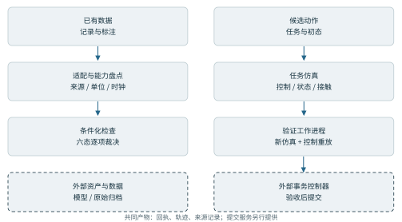
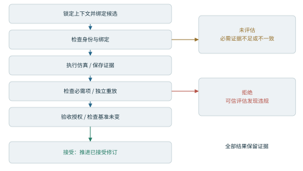
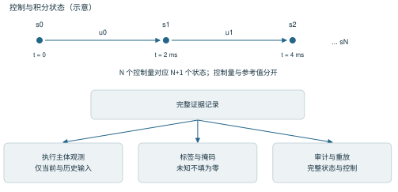
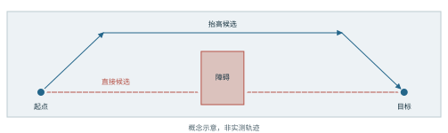
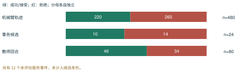
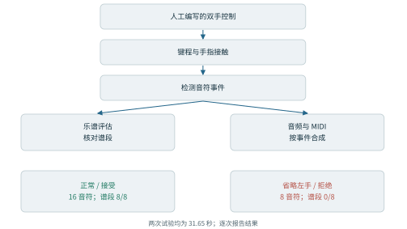

# WorldLedger

## 面向具身智能体的验证中心架构

技术报告 | 图文发布候选版 0.2 | 2026 年 9 月 23 日

作者与所属机构待确认。

## 摘要

具身智能体需要一种计算接口，将动作提案与明确的世界假设、可观测后果以及可复现的验收决策连接起来。本文提出 WorldLedger：一种以经过验证的修订为推进单位、以绑定的证据记录为支撑的架构。该架构将提案生成、仿真执行、证据构建与验收权限分离。上下文契约明确指定具身载体、场景、初始状态、任务和执行协议；提案必须依据这一契约完成评估，才能进入已接受的历史记录。带有明确类型的证据保留了“已观察到违规”与“信息不足”之间的区别。保存控制量的重放使轨迹能够被检查，而明确的观测与标签契约则支持下游数据集构建。本文介绍由现有机器人验证服务和事务服务组成的参考实现，并选取多机器人轨迹生成、可恢复的教师数据生产，以及接触驱动的音视频交互作为工程案例。这些案例证明了系统在声明的仿真条件下具备的具体基础设施能力。WorldLedger 为异构具身工作流程提供共同的组织方式，同时显式保留各任务特有的控制器、验收标准与仿真保真度边界。

## 1. 引言

一个有用的具身智能体接口，需要说明的内容远不止动作和一个标量奖励。动作的含义取决于特定的机体、场景、初始状态、控制器和物理模型。动作评估还取决于哪些量可用、它们如何获得，以及哪些条件定义了任务完成。如果缺少这些依赖关系，即使一条轨迹看起来成功，也很难进行比较、重放或复用。

WorldLedger 将这种依赖结构纳入智能体接口。其核心抽象是有证据支撑的修订：候选动作绑定到世界上下文，通过明确的协议进行评估，只有在所需证据支持接受时才提交。其他候选方案以及未完成的评估仍可被检查，但不会改变已接受的状态。

本文围绕三个相互关联的思想展开。第一，通过绑定上下文的动作契约，明确提案的含义。第二，由独立的验证授权机制决定哪些提案可以改变已接受的记录。第三，将产生的证据转换为数据集，并明确约束其观测、标签和数据划分语义。这三个思想通过共同的来源追溯模型，将世界交互、验证和数据生产连接起来。

WorldLedger 是本文对这一架构的命名，现有实现组件保留原来的名称与接口。所选案例评估的是集成、重放、数据完整性，以及输出与实际事件的对应关系；它们不是策略学习方法的对比评测，也不用于估计机器人的通用能力。架构的适用设计范围大于目前已集成的后端，本文将拟议扩展与已实现行为分别说明。

<!-- pagebreak -->

## 系统总览与发布边界

公开包提供两条主要入口。已有采集记录通过适配器进入条件化数据验证；新生成或提出的机器人轨迹通过任务专用仿真与保存控制重放进入验证。两条路径都生成明确证据，但检查项目与验收语义并不相同。通用数据审计具有六种逐项裁决状态，集成机器人事务使用三类决策结果。[E1, E2]

验证工作进程位于随仓库提供的 organoid_kernel/kabuki_validation.py。第 3 节描述的有状态事务控制器属于外部组件；scripts/kabuki_robot_demo.py 需要提供其源码目录。仓库中的 mcp/service/app.py 是数据集作业服务，并非该事务控制器。从公开快照重建完整架构时，需要保留这一区别。

仓库还提供机型元数据、资产下载工具、轨迹转换、技能表示与部分任务模块。机器人资产、模型权重、外部数据集以及后端专用依赖，需要按所运行模块另行准备。教师数据与音视频案例提供精简的公开结果汇总；完整生产实现和原始归档不包含在本包内。

<!-- pagebreak -->

## 2. 绑定上下文的动作与证据

### 2.1 评估上下文

我们将上下文 C 表示为一个元组，其中包含机器人或执行主体模型 R、场景 W、完整的初始积分状态 s0、任务规范 T，以及执行与验证协议 P。协议明确控制器语义、运行时版本、适用时的随机种子、所需观测和验收阈值。该记号是对现有契约的概括，并不意味着所有后端使用相同的传输格式。[E1, E2]

[[equation]] C = (R, W, s0, T, P);     p = (H(C), a, H(b))

其中，H 表示内容哈希，a 是候选动作，b 是提交提案 p 时所依据的、已接受的基准修订。为了使这些标识具有一致的含义，必须使用规范化序列化。集成的机器人服务分别绑定资产、初始状态、场景、协议、上下文和动作的哈希，其中也包括实现代码与运行时依赖。

动作表示属于后端契约的一部分。它可以描述路径点、有界关节参考值或条件控制器。通用编排层可以处理提案的封装结构，由后端验证其原生动作语义。因此，支持新的具身载体不仅仅是映射向量维度，还必须声明名称、单位、限值、时序、控制器含义和评估覆盖范围。

### 2.2 执行产生证据，而不直接授予提交权限

执行后端根据绑定的上下文和动作，生成轨迹与证据记录。证据记录包括实际施加的控制量、状态、相关传感器流、任务测量值、验证回执及重放产物。对该记录进行评估后才能得到决策；仅仅完成仿真执行，并不意味着允许提交。

[[equation]] Execute(C, a) -> (trajectory, evidence);     Verify(C, p, evidence) -> decision

每个报告的量都需要说明来源类别、单位、时钟，以及采集或推导规则。数据层区分观测值、派生值、假设值与缺失信息。仿真接触力是对仿真器的观测，不是物理硬件的实测值。派生量保留其成立所需的前提条件。缺失通道保持缺失，而不会被悄悄填入一个看似合理的值。[E1]

### 2.3 验证项具有适用条件

一个验证项由待检验的命题、所需输入、评估规则和适用范围组成。碰撞验证需要明确的几何信息和接触解释；放置验证需要目标区域和稳定判据。如果这些输入不可用，就不能仅因为另一个检查通过，而对该验证项作出肯定裁决。

在机器人事务接口处，决策分为 accepted（接受）、rejected（拒绝）和 not_evaluated（未评估）。可信评估发现的违规，可以支持在该协议下拒绝候选；必需证据缺失、损坏或不一致，则应记为未评估。更通用的数据审计流水线还保留修复和警告等类别，不会将它们简单压成二元训练标签。

这种区分使接口能够服务于多种任务。后端可以增加新的验证项类型，而无需重新定义证据缺失的含义。同时，该架构不规定统一的碰撞容差、奖励或成功函数；这些选择始终是协议 P 中带有版本的组成部分。

<!-- pagebreak -->

## 3. 经过验证的修订与验收权限

### 3.1 围绕具身提案建立事务

参考机器人服务首先锁定上下文，接收与该上下文绑定的待处理提案，再启动一次新的验证工作进程。工作进程检查绑定关系，运行执行器力受限的仿真，保存实际施加的控制量和得到的状态，并独立重放这些控制量。服务在提交前检查回执身份、必需验证项、数值阈值和证据哈希。候选排序是可选的提案筛选步骤，排序分数始终不能替代这些检查。[E2]

从概念上说，允许提交需要同时满足：绑定有效、所需证据完整、所有必需检查通过、重放通过，以及基准修订未改变。这是在规定预期的验收规则，并非对整个软件栈的形式化证明。

[[equation]] CommitAllowed = BindingsOK AND EvidenceComplete AND ChecksPass

[[equation]]                         AND ReplayOK AND BaseUnchanged

已接受的历史记录保存的是从各自绑定初态出发、经过验证的计划，不能被解释为物理机器人已经执行了这些计划。同样，从同一初态提交第二个候选，表示另一个备选分支。真正的连续执行需要建立新的上下文，其中携带前次执行产生的积分状态和发生变化的观测。

### 3.2 两种历史记录承担不同职责

事件历史记录所有已提出、已接受、已拒绝和未评估的尝试。已接受的历史只有在事务成功后才推进。同时保留两者，有助于调试和比较备选计划，也能防止被拒绝的候选成为已接受的世界状态。

内容哈希将事件与前序事件绑定，并将决策与证据的具体字节内容绑定。在检查账本时，这使系统能够发现内容变化、产物被替换或上下文不匹配。哈希不能证明物理真实性，不能认证原始观测的真实性，也不能阻止管理员重写全部依赖产物。这些性质需要独立的信任与存储控制。

### 3.3 运行时保障及其边界

集成实现使用 SQLite 事务保护待处理提案和已接受状态。证据在被接受前先写入并计算哈希。运行时故障会保留待处理提案，或生成明确的未知结果；工作进程留下的不完整产物始终能与已提交证据区分。新的验证运行使用新的标识，而不是直接信任此前提供的成功标志。

上述行为围绕三个不变量组织：提案评分不能授权状态修改；已接受证据必须指向实际评估时的同一上下文与动作；失败或未完成的尝试不能从记录中悄悄消失。这些不变量为回归测试提供了具体目标，但不构成有关机器人安全或分布式“恰好一次”执行的定理。

<!-- pagebreak -->

## 验证流程与裁决语义

候选在固定上下文中接受评估，排序不会改变已接受的基准状态。绑定失效、必需证据缺失、回执不一致或重放未通过，都不足以支持接受结论。可信评估发现违规时，依据声明的协议拒绝候选；只有完整且内部一致的通过结果，才可以由外部事务授权方提交。[E2]

例如，绕障转移候选可能在碰到障碍后失败。已执行的轨迹前缀、控制序列和接触证据仍可检查。抬高路径的备选方案必须使用同一声明场景和初态，不能通过悄悄移动障碍获得接受。而力通道缺失会限制能够评估的验证项。这些属于不同诊断，应产生不同记录。

通用数据审计账本在逐项层面保留 accepted、rejected、inconclusive、not_evaluated、not_applicable 和 error 六种状态，再依据策略计算回合级分级。警告或数据修复属于该分级过程，不是新增的物理观测，也不应与三类事务结果混淆。

测量修复路径具有明确限制。对于受支持、能够识别的测量缺陷，可以生成带有前后哈希的派生修订；规划器重新运行相关检查，并比较物理回执是否退化。任务失败、未知标定和任意行为错误，不会因为系统存在账本就自动变得可修复。

<!-- pagebreak -->

## 4. 面向可复现数据的证据编译

### 4.1 区分物理证据与执行主体的观测

仿真记录通常暴露了比执行主体应当观察到的内容更多的状态。世界几何、物体位姿、任务阶段和未来结果可能有助于审计，却不适合作为策略输入。因此，WorldLedger 将数据集导出组织为保留证据上的显式视图，分别定义观测、动作、监督信息和审计字段。

生产实现导出 44 维动作前观测、8 维动作端点，以及带时间戳的 RGB-D。加载器选择时间戳不晚于观测时刻的最新图像。完整仿真器状态仍可用于审计与重放，但不会自动成为执行主体的输入。这是该实现中的一条具体因果对齐规则，而不是对所有任务观测形式的统一定义。[E3]

### 4.2 保留实际控制的时序

动作参考值、执行器命令与观测到的关节位置是不同的量。可复现记录必须保留它们各自的原生语义。在生产操作流水线中，物理积分频率为 500 Hz，动作端点频率为 25 Hz，RGB-D 标称频率为 5 Hz，并额外保留初始与最终快照。对于 N 个实际施加的控制量，状态序列可能包含 N+1 个采样点。

力和接触对应求解器步，运动学量则可能在积分前或积分后采样。导出时必须声明这些对齐关系，不能仅依赖数组长度相同。相机坐标、沿光轴的深度、四元数分量顺序以及执行器原生单位，也都属于数据集契约。下游使用者改变帧率或重建状态转移时，这些细节尤其重要。

### 4.3 标签以实际评估的验证项为依据

成功示范是满足所声明验收条件的轨迹回合。被拒绝的回合可以提供有用的诊断或负例证据，但这并不意味着该回合此前的每个动作都是错误的。未评估的验证项应在损失函数和指标计算中保持屏蔽。在从未尝试抓取、仅执行路径运动的任务中，stable_grasp（稳定抓取）没有实际评估得到的目标标签。

借助这种区分，同一个证据存储可以通过不同的显式视图，支持模仿学习数据集、结果预测模型和失败分析。当前实现已经展示成功回合导出和验证项掩码处理。面向任意学习目标的通用编译器仍属于架构扩展，而非已经验证的能力。

### 4.4 可复现性包含多个层次

记录完整性检查文件是否与清单一致。保存控制量的重放检查记录的命令能否在声明的运行时中复现状态和力。数据包可迁移性检查移动位置后的归档能否解析资产并加载数据。科学可复现性还要求他人重建实验并评估相关主张。前一层通过，并不意味着后续各层都已成立。

服务器发布包记录了 5,247 个经过验证的清单条目，迁移后的包已移除绝对网格路径引用。其可迁移性检查对两个选定回合进行了隔离重放，并检查了全部三个数据划分的加载器；另一份报告则记录了全部 80 个生产回合的保存控制重放。这些检查的对象和覆盖范围不同。[E3]

<!-- pagebreak -->

## 轨迹记录与因果数据视图

轨迹记录保留不同的时钟与量的含义。在机械臂流水线中，积分状态与实际控制量以 2 毫秒步长保存。初态与最后一次控制后的状态，使 N 个控制样本对应 N+1 个状态样本。以弧度表示的机器人参考值与执行器原生控制量分开，后者可能包含其他尺度的夹爪命令。[E5]

公开轨迹格式在 trajectory.npz 中保存数组，在 trajectory.json 中记录形状、数据类型、单位、时钟和来源。生成的回合还附带场景文件、身份记录和验证回执。外部关节状态导入要求声明关节名、单位与时间戳；导入观测不会将其变成可执行的控制命令。

训练数据是证据上的显式视图。执行主体的观测不应获得未来图像或结果测量值；诊断目标保持独立，未知或不适用的标签予以屏蔽。失败回合可以包含有效前缀，把此前每个动作都标为负例，会超出回合级决策实际能够证明的内容。

按场景族划分数据，使同一底层场景的变体保持在一起，减少训练与评估之间的信息泄漏。教师生产案例还增加重启对账与完整的保存控制重放记录。这些机制支持可检查的导出；面向任意目标及全部后端的通用编译器仍属于未来工作。[E3]

<!-- pagebreak -->

## 5. 参考实现与工程案例

### 5.1 实现结构

参考实现结合了证据与仿真内核、事务服务，以及面向特定任务的生成器。相邻的世界平台提供 OpenUSD 与 Blender 适配器、可搜索目录和版本化产物服务。WorldLedger 是这些组件共同架构组织方式的公开名称；源代码保留兼容性包名，但不将其作为公开项目名称。[E1, E2, E4]

以下案例用于说明动作验证、可复现数据生产，以及接触证据与渲染输出之间的联系。每个引用批次的全部试验结果都保留在报告计数中。不同任务和验收门槛不会合并成一个成功率指标。

### 5.2 多机器人轨迹与服务集成

一个覆盖 Panda 和 UR5e 的集合包含 60 个参数族，每个机器人使用四种候选模板，共生成 480 条轨迹。任务包括笛卡尔空间目标到达、工具中心点绕障转移，以及按顺序经过路径点。保留的结果为 220 条成功、260 条拒绝，并记录了 480 次保存控制重放验证。其中 19 组配对将被拒绝候选与同一场景、同一初态下被接受的备选方案关联起来。[E5]

另一个服务集成批次覆盖六个世界，记录了 24 个经过新运行仿真的候选，其中 10 个接受、14 个拒绝，另外还有 12 个拒绝执行的控制操作事件，以 not_evaluated 状态保留。全部六个世界的事件重放都与已接受状态一致。这说明同一验收接口能够分别处理任务结果与不受支持的控制操作，但它并不是在留出任务上进行的泛化基准评测。[E2]

### 5.3 可恢复的教师数据生产

服务器生产批次使用 20 个场景族，每个场景族包含四个教师候选，共保留 80 个轨迹回合：46 个接受、34 个拒绝。导出包包含 26,300 个动作转移样本，其中 20,077 个来自被接受回合，数据规模约为 8.30 GB。全部 80 个回合均记录了独立的保存控制重放验证。一次重启对账检查确认，尝试次数保持为 80，没有增加。[E3]

该实现将同一场景族的所有变体放在同一个数据划分中，在批次运行前冻结源码和上下文，并将完整证据与轻量训练数组分开。这些特性使发布包能够在文档指定的运行时内被检查和复用。测试划分仅包含三个场景族，且没有被拒绝的试验，因此不能用于评估失败判别能力或广泛的场景覆盖。

### 5.4 以接触事件为依据的音视频交互

一个采用坐姿、固定骨盆的 G1 + Inspire 示范使用人工编写的双臂控制器和合成的 88 键乐器。正常条件下，31.65 秒的试验产生 16 个由接触检测得到的音符，并通过八个谱段的判定。配对对照省略左手动作，产生八个音符，最终被拒绝。两只手均使用食指演奏。[E6]

琴键行程和手指接触独立于乐谱决定音符事件。乐谱负责对这些事件评分，音频和 MIDI 则依据检测到的事件、沿仿真时间轴合成。可迁移重放检查复现了状态、执行器力、接触力和音符事件。该案例说明，渲染输出可以与可检查的物理事件绑定。它展示的是人工编写的交互行为，而不是学习得到的音乐策略。

<!-- pagebreak -->

## 工程案例：任务结构与结果计数

机械臂案例检验同一上下文下的多个候选，如何成为可重放、带标签的轨迹。目标到达、绕障转移与有序路径点任务分别考察不同路径条件。机器人模型具有各自的关节几何和执行器语义；任务空间迁移会重新求解目标机器人的逆运动学并重跑动力学，而不是复制源控制量。[E5]

480 条轨迹的案例同时记录成功与拒绝轨迹的重放，并保留 19 组同场景修正对。独立的事务批次考察验收控制和证据保留。80 回合教师批次考察生产计数与核对：总计 26,300 个转移样本，其中 20,077 个来自接受回合。这是三个不同的工程问题，并非共同基准上的三种方法。[E2, E3, E5]

<!-- pagebreak -->

## 工程案例：以接触为依据的音视频输出

该案例考察可见、可听输出能否与可检查的仿真事件绑定。人工编写的控制器驱动双手，琴键位移与手指接触决定音符起止；这些事件分别进入谱段评估及音频/MIDI 合成，从而可以将输出与仿真交互进行核对。[E6]

正常试验产生全部 16 个预期音符，通过 8/8 个谱段。省略左手动作后仍产生 8 个音符，但由于预期的配对事件不完整，通过谱段数为 0/8。因此，存在接触活动本身不足以说明任务完成。两次试验属于人工编写的示范和诊断对照，不是音乐能力的统计估计。

保存的汇总中，两组试验均为 31.65 秒。公开检查记录报告其可迁移性检查中的状态、执行器力、接触力及音符事件重放一致。该结论限于记录中的检查，不证明跨引擎可复现性。公开仓库包含结果和检查汇总，未打包乐器执行程序、完整轨迹、RGB-D 与音视频归档。

<!-- pagebreak -->

## 6. 架构的通用化扩展

### 6.1 可替换的提案生成器

只要生成的动作符合后端契约，提案接口就可以容纳几何规划器、语言模型智能体、学习型控制器或人工编写的候选。验证依据候选本身及其证据，不依赖提案者的身份或置信度。这是架构提供的扩展接口；案例使用的是特定任务生成器，并未证明对任意智能体的兼容性。

这种分离支持一种实用的开发循环：在保持验收协议固定的条件下改进提案；如果协议假设发生变化，则明确建立新版本。能力更强的提案者可以生成更好的候选，但不能因此获得在看到结果后重写任务阈值或环境属性的权限。

### 6.2 后端之间的能力协商

后端应声明它能够生成哪些证据流、评估哪些验证项，以及支持哪些坐标、控制器和时间语义。现有数据规划器已经根据可用输入决定检查是否适用。将这一原则扩展到完整动作接口，可以让编排器在消耗执行资源之前，先确定评估覆盖范围。

场景编辑、机器人轨迹和传感器布置任务可以共享修订标识与证据来源信息，但需要不同的验证器。复用事务结构，不意味着它们的物理语义可以互换。尤其是，几何路径检查不能悄悄替代动力学、接触或硬件执行验证。

### 6.3 证据依赖图

每个验证项都可以表示为对特定输入、运行时版本和阈值的依赖关系。由此可以构建依赖图：叶节点是源产物，内部节点是派生测量值和验证项。资产或协议发生改变，会使受影响的下游验证结论失效。当前的上下文哈希提供了粗粒度的失效机制；对未受影响证据进行细粒度复用，仍是拟议中的扩展。

更丰富的依赖图可以在保留原始结果的同时，支持定向重评估和跨版本比较。这种复用需要明确依赖关系是否完整，以及特定后端的确定性假设。不能仅仅因为任务名称相同，就复用一份回执。

### 6.4 多层次验证

架构区分结构模式检查、几何与运动学可行性、动力学与接触评估、任务完成，以及重放一致性。低成本检查可以提前拒绝格式不合法的提案；高成本检查则提供最终接受所需的证据。现有流水线实现了这一顺序中的不同子集，并非已经存在一个统一的通用评估器。

未来的多引擎或硬件后端，可以向同一个验证项记录补充独立证据通道。这些通道需要各自的标定、不确定性和同步契约。两个引擎是否一致，仍应作为需要报告的实测结果，不能被视为账本抽象天然具备的性质。

### 6.5 从展示资产到可持续维护的研究对象

一个有证据支撑的轨迹回合具有身份标识、依赖集合、观测契约、决策历史和重放程序。这些属性使它能够作为版本化研究对象持续维护，而不只是一个孤立的视频或数组文件。其实际收益是可追溯性：使用者可以查明执行了什么、为什么被接受、哪些内容仍然未知，以及哪些变化需要重新评估。

更广泛的研究方向，是在规划、仿真、渲染和数据集构建之间建立共同的证据接口。当前实现已经提供了这一接口的若干具体实例；评估它在更多领域中的价值，仍是后续工作。

<!-- pagebreak -->

## 7. 适用范围、信任与发布事项

### 7.1 验证的含义

接受结论以建模世界和预先登记的检查项为条件。机器人资产、碰撞近似、执行器模型、固定支撑、接触参数与控制器假设，共同界定结果的适用范围。同一运行时下的重放证明保存执行记录的一致性。向硬件迁移，以及通过独立标定确认物理保真度，需要额外证据。

较成熟的事务执行流程与独立的事件驱动示范具有不同的集成边界。两者都保留可检查证据，但后者没有提交到事务服务。本文用它们说明相互关联的架构职责，并不将其描述为一个已经统一部署的产品。

### 7.2 完整性、权限与运行信任

内容寻址能够相对于预期记录发现不一致，事务隔离能够约束并发状态修改。它们都不能替代用户认证、受控部署、可靠备份或可信的源数据采集。被攻破的评估器可能输出错误测量值，特权操作者也可能改写存储产物。数字签名、外部见证和受保护存储是可行的扩展，但本文所述实现不以它们已经存在为前提。

CommitAllowed 表达式描述的是软件契约。要证明它在每一次执行中都正确，需要超出现有工程证据的形式化工作与验证。本文提出的是明确的验收逻辑、实现和已记录检查，并不声称已获得形式化的安全证明。

### 7.3 实验范围

案例是选定的工程实例，评估轨迹计数与核对、验证流程、重放、导出，以及以实际事件为依据的媒体输出。它们不衡量通用策略质量、自主技能习得或对未见硬件的迁移能力。每个实验保留自己的统计分母、阈值和来源信息，不计算跨实验的综合性能分数。

本修订稿综合了截至 2026 年 9 月 22 日保存的实现文档与审计记录，并不是一次新的全批次仿真复跑。来源索引区分文档、已存结果和可迁移性检查，便于读者检查各项陈述的证据。

### 7.4 发布材料

公开发布包含本架构报告、机器可读的“主张—来源”索引、精简的复现补充材料和选定实现模块。内部来源路径与仅限服务器访问的产物不会进入公开包；公开索引只指向发布包内文件，或以足以界定报告范围的方式描述受限证据。

作者、所属机构、最终公开许可证、相关工作定位及选定的公开补充材料仍待完善。当前为公开发布候选版，尚未预留或注册 DOI。WorldLedger 是本次公开发布使用的架构名称。

## 8. 结论

WorldLedger 围绕绑定上下文的提案、明确的证据，以及由独立机制授权的修订，组织具身交互。参考实现展示了这种组织方式如何连接机器人仿真、事务历史、保存控制重放和数据导出。同一结构也能支持以实际事件为依据的渲染，而不把视觉效果本身当作验收标准。

架构贡献在于为具身工作流程提供一个支持溯源与责任界定的共同契约。其价值是让依赖关系、决策和评估覆盖范围能够被检查，同时保留每个接受结论所依赖的任务特定假设。

<!-- pagebreak -->

## 附录 A. 来源索引与实现对应关系

以下索引列出本修订稿采用的工程证据。内部清单在公开包之外保留准确位置与哈希；本发布只公开稳定的本地引用和精简汇总。

[E1] 证据内核与条件化验证。本地仓库：README.md、docs/multi_robot_pipeline.md。内容包括数据适配器、来源类别、按适用条件运行的检查、轨迹语义、标签掩码和实现边界。

[E2] 事务式验证。公开发布文件：docs/transactional-verification.md、examples/transaction-summary.json。内容包括上下文与动作绑定、工作进程验证、SQLite 验收提交、事件重放，以及六世界集成批次。公开源码在 organoid_kernel/ 下保留兼容性验证模块。

[E3] 教师数据生产与可迁移性。受限生产记录的公开汇总位于 examples/teacher-data-summary.json。它提供批次计数、转移样本数、数据划分细节、包体积和重启对账结果，同时不暴露源工作区或原始归档。报告正文描述了选定的重放与可迁移性覆盖范围。

[E4] 世界与产物平台。公开发布将其作为系统边界记录，不打包相邻平台的实现；其作用概括于 docs/architecture.md。本报告不包含新一轮全平台部署审计。

[E5] 多机器人轨迹集合。公开发布文件：examples/multi-robot-summary.json、docs/multi_robot_pipeline.md。内容包括 480 个回合的计数、任务定义、已记录的重放覆盖情况，以及 19 组同场景修正对。绝对资产路径引用仍是这一历史集合的可迁移性限制。

[E6] 以接触为依据的音视频案例。公开发布文件：examples/contact-audio-results.json、examples/contact-audio-checks.json。内容包括固定骨盆模型、被动琴键、音符检测器、正常与省略左手两组试验的完整结果，以及可迁移重放检查。

### 实现状态

集成机器人流程中已实现：锁定上下文、有约束的候选提交、新运行的仿真验证、保存控制重放、回执检查、事务保护的验收提交，以及拒绝和未知事件的保留。

选定数据发布包中已实现：带时间戳的观测和动作、原生单位元数据、明确的审计字段、按完整场景族划分数据、成功示范导出、清单、支持中断恢复的作业对账，以及选定的迁移后数据包检查。

已通过独立案例展示：由接触得到的音乐事件、独立评分的谱段、同步音视频导出，以及可迁移的控制量、接触和事件重放。

架构扩展方向：接入任意提案生成器、为所有后端提供统一能力协商接口、细粒度证据依赖复用，以及独立的多引擎或硬件见证。这些是设计方向，并非已经测得的能力。

### 如何理解这些证据

文件哈希是完整性参考。保存的回执是一次评估的记录。重放报告说明其检查过的变量与运行时。迁移后数据包检查仅证明其选定检查项的结果。全文保留这些区别，以明确每一项工程主张的适用范围。

<!-- pagebreak -->

## 附录 B. 公开模块与实际入口

### B.1 数据接入与审计

adapters 目录覆盖 LeRobot 布局、ROS bag、通用与厂商 HDF5、UMI/Zarr、已解码运动容器、视频、VR、旧版回合目录及统一轨迹格式。覆盖程度取决于字段和数据模式；识别容器不等于能够解码全部厂商载荷。evidence.py、inventory.py、profile.py 与 planner.py 分别实现流的来源记录、能力盘点、模型绑定与条件化检查规划。

十组注册验证器覆盖质量、流配对、运动学、模型物理、动作文字一致性、传感器健康、源媒体、手部视频证据、视觉渲染和任务场景连续性。通用物理验证器执行准静态模型检查，多机器人执行器则另行提供动态保存控制重放。视频近邻只构成接触候选，不是物理力测量。CLI 提供 inspect、run、batch、golden-compare 及技能相关命令。

### B.2 仿真、轨迹与技能

multi_robot_tasks.py、trajectory.py 与 robot_trajectory_io.py 提供机械臂任务执行器、数组与元数据契约、具名关节导入及有限的位置任务迁移。profiles 目录提供 Panda、UR5e 与一个人形机器人档案，但档案存在不等于配套几何已提供。fetch_robot_models.py 下载固定版本的 Panda/UR5e 资产。build_multi_robot_dataset.py 支持用 --skip-training 仅生成仿真数据；critic 训练需要另行安装 PyTorch。

技能模块表示原子动作、物体类型、前后置条件、末端轨迹、技能挖掘和图组合。其他人形任务、分拣与通用操作模块作为源码层面的构建组件保留，具有各自的模型与后端依赖。表示可以组合，不等于每个组合任务已有可执行或学习得到的控制器。本发布不提供通用训练策略或检查点。

### B.3 服务与分发限制

可选 HTTP 作业服务与 stdio MCP 客户端提供数据集盘点、验证作业、结果获取、上传、产物下载与基线比较。服务依赖及访问配置需要单独准备。旧实验路由引用了未随精选快照提供的脚本，运行这些路由需要补充组件。完整复现从候选到提交的工作流，也需要外部事务服务。

examples 目录提供精简汇总，不是完整重放包。报告中的历史批次数量，不是从干净克隆新生成的结果；本次报告制作未重新运行仿真批次。公开源码属于研究快照，依赖尚未完全锁定，回归覆盖也经过选择；这些范围说明用于帮助读者判断当前能够复现哪些内容。
