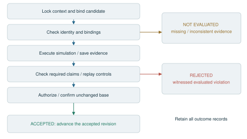
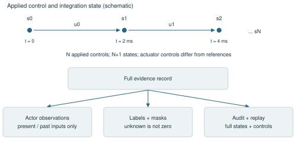
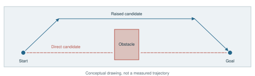
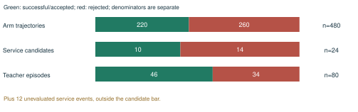
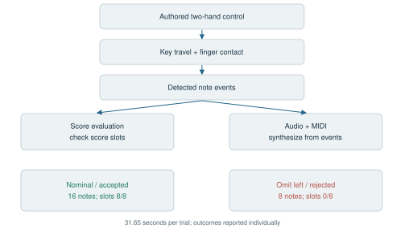

# WorldLedger

## A Verification-Centered Architecture for Embodied Agents

Technical report | Illustrated release candidate 0.2 | September 23, 2026

Authorship and affiliations pending confirmation.

## Abstract

Embodied agents require a computational interface that connects proposed actions to explicit world assumptions, observable consequences, and reproducible acceptance decisions. We present WorldLedger, an architectural formulation in which a unit of progress is a verified revision supported by a bound evidence record. The architecture separates proposal generation, simulation execution, evidence construction, and acceptance authority. A context contract identifies the embodiment, scene, initial state, task, and execution protocol; a proposal is evaluated against that contract before it can enter an accepted history. Typed evidence preserves the distinction between witnessed violations and insufficient information. Saved-control replay makes trajectories inspectable, while explicit observation and label contracts support downstream dataset construction. We describe a reference implementation assembled from existing robot verification and transaction services, and examine selected engineering case studies: multi-robot trajectory generation, resumable teacher-data production, and contact-driven audiovisual interaction. These cases establish concrete infrastructure capabilities under declared simulation conditions. WorldLedger provides a common organization for heterogeneous embodied workflows while leaving task-specific controllers, acceptance criteria, and simulation fidelity explicit.

## 1. Introduction

A useful embodied-agent interface must specify more than an action and a scalar reward. An action has meaning relative to a particular body, scene, initial state, controller, and physical model. Its evaluation also depends on which quantities were available, how they were obtained, and which conditions define completion. Without these dependencies, a successful-looking trajectory is difficult to compare, replay, or reuse.

WorldLedger treats this dependency structure as part of the agent interface. The central abstraction is an evidence-backed revision: a candidate action is bound to a world context, evaluated through an explicit protocol, and committed only when the required evidence supports acceptance. Alternative candidates and incomplete evaluations remain inspectable without changing the accepted state.

This report develops three connected ideas. First, a context-bound action contract makes the meaning of a proposal explicit. Second, a separate verification authority determines which proposals may change the accepted record. Third, the resulting evidence can be compiled into datasets with controlled observation, label, and split semantics. Together, these ideas connect world interaction, verification, and data production through a common provenance model.

WorldLedger is the report-level name for this architecture. Existing implementation components retain their original names and interfaces. The selected case studies assess integration, replay, data integrity, and event grounding; they are not a comparative evaluation of policy learning or an estimate of general robot competence. The architecture is broader than the currently integrated backends, and proposed extensions are identified separately from implemented behavior.

<!-- pagebreak -->

## System overview and release boundary

The public package provides two main entry paths. Existing recordings enter through adapters and conditional data validation. Generated or proposed robot trajectories enter through task-specific simulation and saved-control replay. Both paths produce explicit evidence, but their checks and acceptance semantics are not identical. The general data audit includes six claim states; the integrated robot transaction uses three decision outcomes. [E1, E2]

The validation worker is shipped in organoid_kernel/kabuki_validation.py. The stateful transaction controller described in Section 3 is an external component; scripts/kabuki_robot_demo.py requires its source directory. The included mcp/service/app.py is a dataset job service, not that transaction controller. This distinction matters when reconstructing the full architecture from the public snapshot.

The repository also ships profile metadata, asset-fetch tooling, trajectory conversion, skill representations, and selected task modules. Robot assets, model weights, external datasets, and backend-specific dependencies must be supplied where required. The teacher and audiovisual cases have compact public result summaries; their complete production implementations and raw archives are outside this package.

<!-- pagebreak -->

## 2. Context-bound action and evidence

### 2.1 The evaluation context

We describe a context C as a tuple containing the robot or actor model R, scene W, complete initial integration state s0, task specification T, and execution-and-verification protocol P. The protocol identifies the controller semantics, runtime versions, random seeds where applicable, required observations, and acceptance thresholds. This notation summarizes existing contracts; it is not a claim that all backends share one wire format. [E1, E2]

[[equation]] C = (R, W, s0, T, P);     p = (H(C), a, H(b))

Here H denotes a content hash, a is the candidate action, and b is the accepted base revision against which the proposal p is submitted. Canonical serialization is necessary to make these identities meaningful. The integrated robot service binds separate hashes for assets, initial state, scene, protocol, context, and action, including implementation and runtime dependencies.

The action representation belongs to the backend contract. It may describe waypoints, bounded joint references, or a conditional controller. A generic orchestration layer can handle the proposal envelope while the backend validates its native action semantics. Supporting a new embodiment therefore requires more than mapping vector dimensions: names, units, limits, timing, controller meaning, and evaluation coverage must be declared.

### 2.2 Execution produces evidence, not an authorization

An execution backend produces a trajectory and evidence record from the bound context and action. The evidence record includes the applied controls, states, relevant sensor streams, task measurements, validation receipts, and replay artifacts. Evaluation of that record yields a decision; simulation execution alone does not authorize a commit.

[[equation]] Execute(C, a) -> (trajectory, evidence);     Verify(C, p, evidence) -> decision

Each reported quantity needs a provenance category, unit, clock, and acquisition or derivation rule. The data layer distinguishes observed, derived, assumed, and missing information. A simulated contact force is an observation of the simulator, not a measurement from physical hardware. Derived quantities retain their preconditions. An absent channel remains absent instead of being silently filled with a plausible value. [E1]

### 2.3 Claims have applicability conditions

A verification claim consists of a proposition, required inputs, an evaluation rule, and a scope. A collision claim requires an identified geometry and contact interpretation; a placement claim requires a target region and settling criterion. If those inputs are unavailable, the claim cannot receive an affirmative verdict merely because another check passed.

At the robot transaction boundary, decisions are accepted, rejected, or not_evaluated. A trustworthy evaluated violation supports rejection under that protocol. Missing, corrupted, or inconsistent mandatory evidence supports not_evaluated. The more general data-audit pipeline retains additional repair and warning categories; it is not collapsed into a binary training label.

This distinction makes the interface useful beyond one task. Backends can add new claim types without redefining what missing evidence means. At the same time, the architecture does not prescribe a universal collision tolerance, reward, or success function. Those choices remain versioned parts of P.

<!-- pagebreak -->

## 3. Verified revisions and acceptance authority

### 3.1 A transaction around an embodied proposal

The reference robot service locks a context, accepts a context-bound pending proposal, and launches a fresh verification worker. The worker checks bindings, executes force-limited simulation, saves the applied controls and resulting state, and independently replays those controls. The service checks receipt identity, required claims, numerical thresholds, and evidence hashes before committing. Ranking is an optional proposal-selection step; a ranking score never replaces these checks. [E2]

Conceptually, commit permission is the conjunction of valid bindings, complete required evidence, successful mandatory checks, successful replay, and an unchanged base revision. This is a specification of the intended acceptance rule, not a formal proof of the whole software stack.

[[equation]] CommitAllowed = BindingsOK AND EvidenceComplete AND ChecksPass

[[equation]]                         AND ReplayOK AND BaseUnchanged

The accepted history records verified plans from their bound initial states. It must not be interpreted as a physical robot having executed those plans. Likewise, submitting a second candidate from the same initial state describes an alternative branch. Actual continuation requires a new context carrying the resulting integration state and any changed observations.

### 3.2 Two histories with different responsibilities

The event history records proposed, accepted, rejected, and unevaluated attempts. The accepted history advances only after a successful transaction. Keeping both supports debugging and alternative-plan comparison without allowing a rejected candidate to become accepted world state.

Content hashes bind events to their predecessors and bind decisions to evidence bytes. This permits detection of drift, swapped artifacts, or mismatched contexts when the ledger is checked. Hashing does not establish physical truth, authenticate the original observation, or prevent an administrator from rewriting every dependent artifact. Those properties require separate trust and storage controls.

### 3.3 Runtime guarantees and their boundaries

The integrated implementation uses SQLite transactions to protect pending proposals and accepted state. Evidence is written and hashed before acceptance. Runtime failures preserve the pending proposal or produce an explicit unknown outcome; partial worker artifacts remain distinguishable from committed evidence. New verification runs use fresh identities rather than accepting a previously supplied success flag.

Three invariants organize this behavior: proposal scores cannot authorize state mutation; accepted evidence must refer to the same context and action that were evaluated; and failed or incomplete attempts must not silently disappear from the record. These invariants provide concrete regression-test targets. They do not amount to a theorem about robot safety or distributed exactly-once execution.

<!-- pagebreak -->

## Verification workflow and decision semantics

A candidate is evaluated under a fixed context. Ranking does not change the accepted base. Invalid bindings, missing mandatory evidence, inconsistent receipts, or unsuccessful replay cannot establish acceptance. When trustworthy evaluation supplies a violation, the candidate is rejected under the declared protocol. A complete, internally consistent pass may be committed by the external transaction authority. [E2]

For example, an obstacle-transfer candidate may fail after contact with the obstacle. Its executed prefix, control sequence, and contact evidence remain inspectable. A raised alternative must use the same declared scene and initial state; acceptance cannot be obtained by quietly moving the obstacle. A missing force channel instead limits the claims that can be evaluated. These are different diagnoses and should produce different records.

The general data-audit ledger preserves accepted, rejected, inconclusive, not_evaluated, not_applicable, and error at claim level. An episode-level grade is subsequently computed from policy. A warning or a data repair belongs to that grading process; it is not an additional physical observation and should not be conflated with the three transaction outcomes.

The measurement-repair path is deliberately limited. A supported, identifiable measurement defect may produce a derived revision with before/after hashes. The planner reruns the relevant checks and compares physical receipts for regressions. Task failure, unknown calibration, and arbitrary behavior errors do not become automatically repairable merely because a ledger exists.

<!-- pagebreak -->

## 4. Evidence compilation for reproducible data

### 4.1 Separate physical evidence from actor observations

A simulation record often exposes more state than an actor should observe. World geometry, object poses, task phases, and future outcomes may be useful for auditing but inappropriate as policy inputs. WorldLedger therefore organizes dataset export as an explicit view over retained evidence, with separate observation, action, supervision, and audit fields.

The production implementation exports 44-dimensional pre-action observations, eight-dimensional action endpoints, and timestamped RGB-D. The loader chooses the most recent image whose timestamp does not exceed the observation time. Full simulator state remains available for auditing and replay without automatically becoming part of the actor's input. This is a concrete causal-alignment rule for that implementation, rather than a universal observation definition. [E3]

### 4.2 Preserve the timing of applied control

An action reference, an actuator command, and an observed joint position are different quantities. A reproducible record preserves their native semantics. In the production manipulation pipeline, physical integration occurs at 500 Hz, action endpoints at 25 Hz, and RGB-D nominally at 5 Hz with initial and final snapshots. A state sequence may contain N+1 samples for N applied controls.

Forces and contacts correspond to solver steps; kinematic quantities may be sampled before or after integration. Export must declare this alignment instead of relying on matching array lengths. Camera coordinates, optical-axis depth, quaternion order, and native actuator units are part of the dataset contract. These details are essential when a downstream consumer changes the frame rate or reconstructs a transition.

### 4.3 Labels are conditional on measured claims

A successful demonstration is an episode for which the declared acceptance conditions hold. A rejected episode can provide useful diagnostic or negative evidence, but it does not imply that every action in its prefix was incorrect. Unevaluated claims should remain masked in losses and metrics. In a trajectory-only task that never attempts a grasp, stable_grasp has no measured target.

These distinctions allow the same evidence store to support imitation datasets, outcome models, and failure analysis through different declared views. The current implementation demonstrates successful-episode export and masked claim handling. A general-purpose compiler for arbitrary learning objectives is an architectural extension, not an already validated capability.

### 4.4 Reproducibility has several layers

Record integrity checks that files match their manifest. Saved-control replay checks that the recorded commands reproduce state and forces in a declared runtime. Package portability checks that a relocated archive resolves assets and loads its data. Scientific reproducibility additionally requires someone to reconstruct the experiment and assess the claim. Passing an earlier layer does not establish every later one.

The server release records 5,247 verified manifest entries and removal of absolute mesh references in the relocated package. Its portability probe replays two selected episodes in isolation and exercises loaders for all three splits; a separate report records saved-control replay for all 80 production episodes. These are different checks with different coverage. [E3]

<!-- pagebreak -->

## Trajectory records and causal dataset views

A trajectory record preserves distinct clocks and meanings. In the arm pipeline, integration states and applied controls are retained at a 2 ms step. The initial state and final post-control state account for N+1 state samples versus N control samples. A robot reference in radians is separate from native actuator control, which can include a gripper command on another scale. [E5]

The public trajectory format stores arrays in trajectory.npz and their shape, dtype, units, clocks, and provenance in trajectory.json. A scene file, identity record, and validation receipt accompany generated episodes. External joint-state import requires joint names, units, and timestamps; importing an observation does not convert it into an executable control command.

Training is a declared view over evidence. Actor observations should not receive later images or outcome measurements. Diagnostic targets remain separate, and unknown or inapplicable labels are masked. A failed episode can contain a valid prefix; assigning a negative label to every preceding action would assert more than the episode-level decision proves.

Scene-family splits keep variants of one underlying scene together, reducing leakage between training and evaluation. The teacher production example adds restart reconciliation and complete saved-control replay records. This supports inspectable exports, while a general compiler for arbitrary objectives and all backends remains future work. [E3]

<!-- pagebreak -->

## 5. Reference implementation and engineering cases

### 5.1 Implementation structure

The reference implementation combines an evidence-and-simulation kernel, a transaction service, and task-specific generators. An adjacent world platform provides OpenUSD and Blender adapters, a searchable catalog, and versioned artifact services. WorldLedger names the common architectural organization of these components; the release keeps compatibility package names in source code without treating them as the public project name. [E1, E2, E4]

The following cases were selected to illustrate action verification, reproducible data production, and the connection between contact evidence and rendered outputs. All trial outcomes within each cited batch remain in the reported counts. Different tasks and acceptance gates are not pooled into a single success metric.

### 5.2 Multi-robot trajectories and service integration

A collection spanning Panda and UR5e includes 60 parameter families and four candidate templates per robot, for 480 trajectories. Tasks include Cartesian target reaching, tool-center-point obstacle transfer, and ordered waypoints. The retained outcomes are 220 successful and 260 rejected, with 480 recorded saved-control replay verifications. Nineteen pairs connect a rejected candidate to an accepted alternative under the same scene and initial-state conditions. [E5]

A separate service integration batch spans six worlds. It records 24 freshly simulated candidates, of which ten are accepted and fourteen rejected, plus twelve refused-control events retained as not_evaluated. Event replay matches accepted state in all six worlds. This demonstrates distinct handling of task outcomes and unsupported control operations within one acceptance interface. It is not a held-out task-generalization benchmark. [E2]

### 5.3 Resumable teacher-data production

The server production batch uses twenty scene families and four teacher candidates per family. It retains 80 episodes: 46 accepted and 34 rejected. The export contains 26,300 action transitions, including 20,077 accepted-episode transitions, and approximately 8.30 GB of data. All 80 episodes have recorded independent saved-control replay verification. A restart reconciliation check left the attempt count unchanged at 80. [E3]

The implementation keeps all variants of a scene family in one split, freezes source and context before the batch, and separates full evidence from lightweight training arrays. These features make the release inspectable and reusable within its documented runtime. The test partition contains only three families and no rejected trials, so it does not evaluate failure discrimination or broad scene coverage.

### 5.4 Contact-grounded audiovisual interaction

A seated, fixed-pelvis G1 + Inspire demonstration uses an authored two-arm controller and a synthetic 88-key instrument. The nominal 31.65-second trial produces sixteen contact-detected notes and passes eight score slots. A paired control omitting the left hand produces eight notes and is rejected. Each hand uses its index finger. [E6]

Key travel and finger contact determine note events independently of the score. The score grades those events; audio and MIDI are synthesized from the detected events on the simulation time axis. Portable replay checks reproduce state, actuator forces, contact forces, and note events. This case illustrates how rendered outputs can be tied to inspectable physical events. It demonstrates an authored interaction, not a learned musical policy.

<!-- pagebreak -->

## Engineering cases: task structure and accounting

The arm case tests how multiple candidates under a shared context become replayable, labelled trajectories. Reaching, obstacle transfer, and ordered waypoint tasks exercise distinct path conditions. The robot models have their own joint geometry and actuator semantics; task-space transfer re-solves destination IK and reruns dynamics instead of copying source controls. [E5]

The 480-trajectory case records replay for both successful and rejected trajectories, including 19 same-scene correction pairs. The separate transaction batch exercises acceptance control and evidence retention. The 80-episode teacher batch exercises production accounting: 26,300 transitions in total and 20,077 from accepted episodes. These are three different engineering questions, not three methods on a common benchmark. [E2, E3, E5]

<!-- pagebreak -->

## Engineering case: contact-grounded audiovisual output

This case asks whether visible and audible outputs can be tied to inspectable simulated events. An authored controller moves the two hands. Key displacement and finger contact determine note onset and release. Those events independently feed score evaluation and audio/MIDI synthesis, allowing the output to be checked against the simulated interaction. [E6]

The nominal trial produces all sixteen expected notes and passes eight of eight score slots. Omitting the left-hand motion leaves eight notes but passes zero of eight slots because the intended paired events are incomplete. Contact activity alone therefore does not establish task completion. The two trials are an authored demonstration and a diagnostic control, not a statistical estimate of musical capability.

Both trials last 31.65 seconds in the saved summaries. The released check record reports matching replayed state, actuator force, contact force, and note events in its portability probe. Its scope is the recorded probe; it does not establish cross-engine reproducibility. The public repository includes result and check summaries, while the instrument executable, full trajectory, RGB-D, and audiovisual archive are not bundled.

<!-- pagebreak -->

## 6. Generalization of the architecture

### 6.1 Interchangeable proposal generators

The proposal interface can accommodate a geometric planner, a language-model agent, a learned controller, or a human-authored candidate if the resulting action satisfies the backend contract. Verification depends on the candidate and its evidence, rather than the identity or confidence of the proposer. This is an architectural extension point. The case studies use specific task generators and do not establish arbitrary-agent compatibility.

This separation supports a practical development loop: improve proposals while keeping the acceptance protocol fixed, or version the protocol explicitly when its assumptions change. A more capable proposer can generate better candidates without acquiring permission to rewrite task thresholds or environment properties after observing an outcome.

### 6.2 Capability negotiation across backends

A backend should declare which evidence streams it can produce, which claims it can evaluate, and which coordinate, controller, and time semantics it supports. The existing data planner already conditions checks on available inputs. Extending this principle to the full action interface would let an orchestrator determine evaluation coverage before spending execution resources.

A scene edit, a robot trajectory, and a sensor-placement task may share revision identity and evidence provenance while requiring different validators. Reusing the transaction structure does not make their physical semantics interchangeable. In particular, a geometric path check cannot silently stand in for dynamics, contact, or hardware execution.

### 6.3 Evidence dependency graphs

Each claim can be represented as depending on specific inputs, runtime versions, and thresholds. This suggests a dependency graph whose leaves are source artifacts and whose internal nodes are derived measurements and claims. A changed asset or protocol invalidates the affected downstream claims. Current context hashes provide a coarse invalidation mechanism; fine-grained reuse of unaffected evidence is a proposed extension.

A richer graph could support targeted reevaluation and cross-version comparison while preserving the original result. Such reuse would require explicit dependency completeness and backend-specific determinism assumptions. It should not reuse a receipt solely because its task name matches.

### 6.4 Multi-scale verification

The architecture distinguishes schema checks, geometric and kinematic feasibility, dynamic and contact evaluation, task completion, and replay consistency. Cheap checks can reject malformed proposals early; expensive checks can supply the evidence needed for final acceptance. The existing pipelines implement subsets of this ordering, rather than one universal evaluator.

Future multi-engine or hardware backends could add independent evidence channels to the same claim record. Those channels would need their own calibration, uncertainty, and synchronization contracts. Agreement between two engines would still be a measured result to report, not a property inherited from the ledger abstraction.

### 6.5 From demonstration assets to maintained research objects

An evidence-backed episode has an identity, dependency set, observation contract, decision history, and replay procedure. These properties allow it to be maintained as a versioned research object rather than an isolated video or array file. The practical benefit is traceability: a consumer can determine what was executed, why it was accepted, what remains unknown, and which changes require reevaluation.

The broader research direction is a common evidence interface between planning, simulation, rendering, and dataset construction. Current implementations provide several concrete instances of that interface; evaluating its usefulness across additional domains remains future work.

<!-- pagebreak -->

## 7. Scope, trust, and release considerations

### 7.1 Meaning of verification

Acceptance is conditional on the modeled world and the registered checks. Robot assets, collision approximations, actuator models, fixed supports, contact parameters, and controller assumptions define the result's scope. Same-runtime replay demonstrates consistency of the saved execution. Hardware transfer and independently calibrated physical fidelity require additional evidence.

The mature transaction path and the standalone event-based demonstration have different integration boundaries. Both retain inspectable evidence, but the latter was not submitted through the transaction service. The report uses them to illustrate related architectural responsibilities without presenting them as a single deployed product.

### 7.2 Integrity, authority, and operational trust

Content addressing detects inconsistencies relative to an expected record. Transaction isolation constrains concurrent state changes. Neither replaces authenticated users, controlled deployment, durable backups, or trustworthy source acquisition. A compromised evaluator may emit incorrect measurements, and a privileged operator may rewrite stored artifacts. Digital signatures, external attestations, and protected storage are possible extensions; they are not assumed in the reported implementation.

The expression for CommitAllowed describes a software contract. Establishing its correctness for every execution would require formalization and verification beyond the present engineering evidence. The report claims explicit acceptance logic, implementation, and recorded checks, rather than formally proven safety.

### 7.3 Experimental scope

Case studies are selected engineering examples. They assess trajectory accounting, verification workflow, replay, export, and event-grounded media. They do not measure universal policy quality, autonomous skill acquisition, or transfer to unseen hardware. Each experiment retains its own denominator, thresholds, and provenance. There is no aggregate performance score across them.

This revision synthesizes saved implementation documents and audit records as of September 22, 2026. It does not constitute a new full-batch simulation rerun. The source index distinguishes documentation, stored results, and portability probes so that readers can inspect the evidence supporting each statement.

### 7.4 Publication package

The public release comprises this architecture report, a machine-readable claim-to-source index, a compact reproducibility supplement, and the selected implementation modules. Internal source paths and server-only artifacts are intentionally omitted; the public index points only to release-local files or describes restricted evidence at the level needed to reproduce the reported scope.

Authorship, affiliations, the final public license, related-work positioning, and the selected public supplement remain to be completed. This is a public release candidate; no DOI has been reserved or registered. WorldLedger is the public architecture name used for this release.

## 8. Conclusion

WorldLedger organizes embodied interaction around a context-bound proposal, explicit evidence, and a separately authorized revision. Its reference implementations demonstrate how that organization can connect robot simulation, transaction history, saved-control replay, and data export. The same structure also accommodates event-grounded rendering without treating visual appearance as an acceptance criterion.

The architectural contribution is a common contract for accountability across embodied workflows. Its value lies in making dependencies, decisions, and evaluation coverage inspectable while preserving the task-specific assumptions on which every accepted result depends.

<!-- pagebreak -->

## Appendix A. Source index and implementation mapping

The index below identifies the engineering evidence used in this revision. Internal manifests retain exact provenance outside the public package; this release exposes only stable, local references and compact summaries.

[E1] Evidence kernel and conditional validation. Local repository: README.md and docs/multi_robot_pipeline.md. Sources describe data adapters, provenance categories, applicability-dependent checks, trajectory semantics, masked labels, and implementation boundaries.

[E2] Transactional verification. Public release files: docs/transactional-verification.md and examples/transaction-summary.json. These describe context and action bindings, worker verification, SQLite acceptance, event replay, and the six-world integration batch. The public source retains the compatibility validation module under organoid_kernel/.

[E3] Teacher-data production and portability. The restricted production record is summarized in examples/teacher-data-summary.json. It supplies batch counts, transitions, split details, package size, and restart reconciliation without exposing the source workspace or raw archive. The public report describes the selected replay and portability coverage.

[E4] World and artifact platform. The public release records this as a system boundary rather than bundling the adjacent platform implementation. Its role is summarized in docs/architecture.md; a fresh whole-platform deployment audit is outside this report.

[E5] Multi-robot trajectory collection. Public release files: examples/multi-robot-summary.json and docs/multi_robot_pipeline.md. These supply the 480-episode counts, task definitions, recorded replay coverage, and nineteen same-scene correction pairs. Absolute asset references remain a portability limitation of this historical collection.

[E6] Contact-grounded audiovisual example. Public release files: examples/contact-audio-results.json and examples/contact-audio-checks.json. These describe the fixed-pelvis model, passive keys, note detector, complete nominal and omitted-left-hand trial outcomes, and the portable replay check.

### Implementation status

Implemented in the integrated robot path: locked contexts, bounded candidate submission, fresh simulation verification, saved-control replay, receipt checks, transaction-protected acceptance, and preservation of rejected and unknown events.

Implemented in selected data releases: timestamped observations and actions, native-unit metadata, explicit audit fields, whole-family splits, successful-demonstration export, manifests, resumable job reconciliation, and selected relocated-package checks.

Demonstrated as a separate example: contact-derived musical events, independently graded score slots, synchronized audiovisual export, and portable control/contact/event replay.

Architectural extensions: arbitrary proposal-generator integration, a uniform capability-negotiation interface for all backends, fine-grained evidence dependency reuse, and independent multi-engine or hardware attestations. These are design directions rather than measured capabilities.

### Reading the evidence

A file hash is an integrity reference. A stored receipt is a record of an evaluation. A replay report documents its tested variables and runtime. A relocated-package check documents only its selected probes. This distinction is preserved throughout the report so that the scope of each engineering claim remains explicit.

<!-- pagebreak -->

## Appendix B. Public modules and practical entry points

### B.1 Data ingestion and auditing

The adapters directory covers LeRobot layouts, ROS bags, generic and vendor HDF5, UMI/Zarr, decoded motion containers, video, VR, legacy episode directories, and the unified trajectory format. Coverage is field- and schema-dependent; recognizing a container does not guarantee decoding every vendor payload. evidence.py, inventory.py, profile.py, and planner.py implement stream provenance, capability inspection, model binding, and conditional check planning.

Ten registered validator groups cover quality, stream pairing, kinematics, model-based physics, motion-language consistency, sensor health, source media, hand-video evidence, visual rendering, and task-scene continuity. The generic physics validator performs quasi-static model checks; the multi-robot runner separately provides dynamic saved-control replay. Video proximity is a contact candidate, not a physical force measurement. The CLI exposes inspect, run, batch, golden-compare, and skill-related commands.

### B.2 Simulation, trajectories, and skills

multi_robot_tasks.py, trajectory.py, and robot_trajectory_io.py provide the arm task runner, array/metadata contract, named-joint import, and limited position-based task transfer. The profiles directory ships Panda, UR5e, and a humanoid profile; profile presence does not supply the corresponding geometry. fetch_robot_models.py fetches pinned Panda/UR5e assets. build_multi_robot_dataset.py supports --skip-training for simulation-only generation; critic training requires PyTorch separately.

The skill modules represent atomic actions, object types, pre/postconditions, end-effector trajectories, mining, and graph composition. Additional humanoid task, sorting, and generic manipulation modules remain source-level building blocks with their own model and backend dependencies. A composable representation does not establish that every composed task has an executable or learned controller. This release does not supply a universal trained policy or checkpoint.

### B.3 Services and distribution limits

The optional HTTP job service and stdio MCP client expose dataset inspection, validation jobs, result retrieval, uploads, artifacts, and baseline comparison. Service dependencies and access configuration must be installed separately. Legacy experiment routes reference scripts not shipped in this selected snapshot; those routes require additional components. The external transaction service is also required to reproduce the complete candidate-to-commit workflow.

The examples directory supplies compact summaries, not full replay packages. Historical batch counts in this report are not new results from a clean checkout. Report generation adds no simulation rerun. The public source is a research snapshot with an incomplete dependency lock and selected regression coverage; its scope is documented for readers assessing what they can reproduce today.
