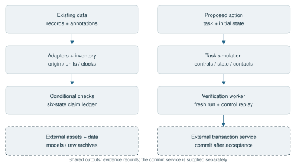

# WorldLedger

## A Verification-Centered Architecture for Embodied Agents

Technical report | September 23, 2026

## Abstract

Embodied actions depend on a body, scene, initial state, controller, and evaluation protocol. WorldLedger binds these dependencies to each proposal and separates execution from the authority to accept its result. The unit of progress is a verified revision supported by an evidence record containing applied controls, states, measurements, and validation receipts. Conditional claims distinguish observed violations from insufficient evidence; saved-control replay tests execution consistency; observation and label contracts govern dataset export. Engineering cases examine multi-robot trajectories, transaction-controlled acceptance, resumable teacher-data production, and contact-derived audiovisual output. They demonstrate verification, accounting, and replay under declared simulation conditions. The architecture connects these workflows through shared provenance while retaining task-specific controllers and acceptance criteria.

## 1. Introduction

An action and a scalar reward do not fully describe a robot interaction. The action depends on the embodiment and controller; its outcome depends on the scene and initial state; its evaluation depends on available measurements and completion criteria. Without these dependencies, a trajectory is difficult to compare, replay, or reuse.

WorldLedger represents a candidate action as a proposal bound to a world context. Execution produces evidence. A separate authority evaluates that evidence and commits an accepted revision only when the required checks pass. Rejected candidates and incomplete evaluations remain available for inspection without changing the accepted state.

This separation connects three operations: proposing actions under an explicit contract, authorizing state changes from evidence, and compiling the resulting records into datasets. A common provenance model links each exported observation or label to the execution and checks that support it.

<!-- pagebreak -->

### 1.1 System organization



The system has two entry paths. Recorded data enters through adapters that identify streams, units, clocks, and available evidence before selecting applicable checks. Proposed robot actions enter through task-specific simulation and saved-control replay. Both paths produce evidence records; the data audit assigns claim-level verdicts, while the transaction service decides whether a candidate may advance accepted state. [E1, E2]

The verification worker is included in organoid_kernel/kabuki_validation.py. The stateful transaction controller is supplied separately; scripts/kabuki_robot_demo.py requires its source directory. The HTTP service in mcp/service/app.py manages dataset jobs. An adjacent world platform supplies OpenUSD and Blender adapters, a catalog, and versioned artifact services; its implementation is also external. [E4]

Robot models and backend dependencies must be supplied for execution. The teacher-data and audiovisual cases are distributed as result summaries rather than complete executable archives. Appendix B identifies the available modules and their dependencies.

<!-- pagebreak -->

## 2. Context-bound actions and evidence

### 2.1 Evaluation context

A context C contains the robot or actor model R, scene W, complete initial integration state s0, task specification T, and execution-and-verification protocol P. The protocol specifies controller semantics, runtime versions, applicable random seeds, required observations, and acceptance thresholds. A proposal p binds a candidate action a to that context and an accepted base revision b. [E1, E2]

```text
C = (R, W, s0, T, P);     p = (H(C), a, H(b))
```

H denotes a content hash over canonically serialized inputs. The robot service binds asset, initial-state, scene, protocol, context, and action hashes, including implementation and runtime dependencies. Changing any bound dependency requires reevaluation.

The backend defines the action representation, such as waypoints, bounded joint references, or a conditional controller. Supporting another embodiment requires declared joint names, units, limits, timing, and controller semantics, together with the claims that can be evaluated.

### 2.2 Evidence records

Execution produces a trajectory and an evidence record containing applied controls, states, sensor streams, task measurements, validation receipts, and replay artifacts. Verification evaluates this record before a commit can be authorized.

```text
Execute(C, a) -> (trajectory, evidence);     Verify(C, p, evidence) -> decision
```

Each quantity carries its provenance, unit, clock, and acquisition or derivation rule. The data layer distinguishes observed, derived, assumed, and missing values. A simulated contact force is an observation of the simulator. Derived values retain their preconditions, and absent channels remain missing. [E1]

### 2.3 Conditional claims and decisions

A verification claim specifies a proposition, required inputs, evaluation rule, and scope. Collision checking requires identified geometry and contact semantics; placement checking requires a target region and settling criterion. A claim without its required inputs cannot receive an affirmative verdict.

The robot transaction has three outcomes. Acceptance requires complete evidence and successful mandatory checks. Rejection records a violation established by trustworthy evaluation. Missing, corrupted, or inconsistent mandatory evidence yields not_evaluated. Collision tolerances and success criteria belong to the declared protocol.

The data-audit ledger retains six claim-level states: accepted, rejected, inconclusive, not_evaluated, not_applicable, and error. Policy maps these verdicts into episode-level grades, including warnings and repair outcomes. Those grades do not add physical observations.

A supported measurement defect may produce a derived record with before/after hashes. The planner reruns relevant checks and compares physical receipts for regressions. This repair mechanism requires an identifiable measurement defect; it does not repair arbitrary task failures or unknown calibration.

<!-- pagebreak -->

## 3. Verified revisions and acceptance authority


The transaction service locks a context, receives a bound pending proposal, and launches a fresh verification worker. The worker checks bindings, runs force-limited simulation, saves applied controls and states, and independently replays those controls. The service verifies receipt identity, mandatory claims, thresholds, and evidence hashes before committing. Proposal ranking cannot authorize a state change. [E2]

```text
CommitAllowed = BindingsOK AND EvidenceComplete AND ChecksPass
                AND ReplayOK AND BaseUnchanged
```

The event history retains every attempt. The accepted history advances within a SQLite transaction only after verification succeeds. Evidence is written and hashed before acceptance; runtime failures preserve a pending proposal or record an unknown outcome. Partial artifacts remain distinguishable from committed evidence.

Hashes bind events to predecessors and decisions to evidence bytes, enabling detection of altered artifacts or mismatched contexts. The acceptance contract requires that committed evidence refer to the evaluated action and context, and that failed or incomplete attempts remain recorded.

Accepted revisions describe verified plans from their bound initial states. A second candidate from the same state is an alternative branch. Continuing an execution requires a new context carrying the resulting integration state and changed observations.

<!-- pagebreak -->

## 4. Evidence compilation for reproducible data


### 4.1 Timing and observation contracts

Applied actuator commands, action references, and observed joint positions have distinct semantics. The arm pipeline saves integration state and controls at 2 ms intervals. trajectory.npz contains arrays; trajectory.json declares shapes, dtypes, units, clocks, and provenance. Each generated episode also includes a scene, identity record, and validation receipt. [E5]

The teacher pipeline integrates at 500 Hz, emits action endpoints at 25 Hz, and records RGB-D nominally at 5 Hz with initial and final snapshots. It exports 44-dimensional pre-action observations and eight-dimensional action endpoints. The loader selects the latest image no later than the observation time, excluding future frames from actor inputs. [E3]

Forces and contacts correspond to solver steps; kinematics may be sampled before or after integration. Exports declare this alignment, camera coordinates, optical-axis depth, quaternion order, and native actuator units. External joint-state import requires named joints, units, and timestamps; observed positions alone do not specify executable controls.

### 4.2 Labels and dataset splits

Full simulator state supports audit and replay, while policy inputs use an explicit observation view. Labels depend on evaluated claims: unknown or inapplicable claims remain masked in losses and metrics. A trajectory-only task that never attempts a grasp has no measured stable_grasp target.

A rejected episode can contain a valid prefix, so its outcome does not label every preceding action as incorrect. Export supports successful demonstrations and masked claim targets. Scene-family splits keep variants of one underlying scene together to reduce leakage between training and evaluation.

<!-- pagebreak -->

## 5. Engineering cases

### 5.1 Multi-robot trajectories


The Panda and UR5e collection contains 60 parameter families with four candidate templates per robot, producing 480 trajectories. Tasks cover Cartesian target reaching, tool-center-point obstacle transfer, and ordered waypoints. The outcomes are 220 successful and 260 rejected; all 480 have recorded saved-control replay verification. Nineteen pairs associate a rejected candidate with an accepted alternative under the same scene and initial state. [E5]

An obstacle collision leaves the executed prefix, controls, and contact evidence available for diagnosis. An alternative candidate must use the same bound scene and initial state to support a same-context comparison. The two robot models retain their own joint geometry and actuator semantics; task-space transfer solves destination inverse kinematics and reruns dynamics rather than copying source controls.

### 5.2 Transaction-service integration

A separate batch covers six worlds and 24 freshly simulated candidates: ten accepted and fourteen rejected. Twelve additional refused-control events are recorded as not_evaluated. Event replay matches the accepted state in all six worlds. [E2]

This batch tests the distinction between evaluated task outcomes and operations that cannot be evaluated, and checks whether the event history reconstructs accepted state. The arm and transaction batches use different tasks and acceptance protocols; their counts are not a comparison of policy quality.

<!-- pagebreak -->

### 5.3 Resumable teacher-data production


The teacher batch contains twenty scene families and four candidates per family: 80 episodes, with 46 accepted and 34 rejected. The export holds 26,300 action transitions, including 20,077 from accepted episodes, and approximately 8.30 GB of data. All 80 episodes have recorded independent saved-control replay verification. Restart reconciliation leaves the attempt count unchanged at 80. [E3]

Source and context are frozen before generation. Variants of a scene family share one split, and lightweight training arrays remain separate from full evidence. The test partition contains only three families and no rejected trials, limiting its use for failure discrimination.

Reproducibility is checked at distinct levels. Manifest validation tests file integrity. Saved-control replay tests whether commands reproduce states and forces in the declared runtime. Package portability tests asset resolution and loading after relocation. Independent reproduction additionally requires rebuilding the experiment and reassessing its conclusions.

The production package records 5,247 verified manifest entries and removal of absolute mesh references after relocation. Its portability check replays two selected episodes in isolation and exercises loaders for all three splits. This two-episode probe and the 80-episode replay record have different coverage. The public summary exposes batch counts and restart reconciliation; the raw archive is not distributed.

<!-- pagebreak -->

### 5.4 Contact-derived audiovisual interaction


A seated, fixed-pelvis G1 + Inspire model uses an authored two-arm controller and a synthetic 88-key instrument. Each hand plays with its index finger. Key displacement and finger contact determine note onset and release independently of the score; the resulting events drive score evaluation and audio/MIDI synthesis on the simulation timeline. [E6]

Both trials last 31.65 seconds. The nominal trial produces all sixteen expected notes and passes eight of eight score slots. Omitting left-hand motion produces eight notes but passes zero slots because the expected paired events are incomplete. The control shows that contact activity alone does not establish task completion.

The portability check reports matching replayed state, actuator force, contact force, and note events. These results connect rendered output to inspectable simulated events under the tested runtime. The demonstration uses authored control and is independent of the transaction service; it does not evaluate learned musical behavior.

The repository includes trial and check summaries. The instrument executable, full trajectories, RGB-D, and audiovisual archive are external.

<!-- pagebreak -->

## 6. Architectural extensions

### 6.1 Proposal generators and backend capabilities

A planner, language-model agent, learned controller, or human can supply proposals if their actions satisfy the backend contract. Verification remains dependent on the action and evidence, so changing the proposer does not change acceptance thresholds. The cases exercise task-specific generators; integration with arbitrary agents remains untested.

The data planner already selects checks from available inputs. Extending capability declarations to the action interface would let an orchestrator determine supported evidence streams, claims, coordinates, and control semantics before execution. Shared revision identities would then support different task backends without treating their physical checks as interchangeable.

### 6.2 Evidence dependencies and staged verification

Context hashes invalidate results when bound dependencies change. A finer dependency graph could connect artifacts to derived measurements and claims, enabling targeted reevaluation of affected results. Reusing unaffected evidence would require complete dependency declarations and explicit determinism assumptions.

Validation can proceed from schema checks through geometry and kinematics to dynamics, contact, task completion, and replay. Early checks can reject malformed proposals before expensive simulation. Multi-engine or hardware evidence could extend this structure, but each channel would require calibration, uncertainty, and synchronization contracts. These extensions are not established by same-runtime replay.

## 7. Limitations and trust

Acceptance is conditional on robot assets, collision approximations, actuator and contact models, fixed supports, controller assumptions, and registered checks. Replay establishes consistency within the tested runtime; hardware transfer and physical fidelity require independent evidence.

Content hashes and database transactions protect record consistency. They do not authenticate observations or prevent a compromised evaluator from emitting false measurements. Authentication, controlled deployment, durable storage, and external attestations address separate trust requirements. CommitAllowed is an implementation contract, not a formal safety proof.

The cases assess verification, accounting, replay, and data export. They do not estimate general policy quality, autonomous skill acquisition, or transfer to unseen hardware. Counts have task-specific denominators and are reported separately. Public summaries document the recorded outcomes but do not provide all assets needed for independent reproduction.

## 8. Conclusion

WorldLedger connects action proposals, verification decisions, and dataset records through a bound context and explicit evidence. Separating execution from acceptance preserves rejected and incomplete attempts while preventing them from advancing accepted state. Saved controls and declared observation and label semantics make accepted trajectories inspectable and reusable within their measured scope.

<!-- pagebreak -->

## Appendix A. Evidence sources

[E1] Evidence kernel and conditional validation: organoid_kernel/, tests/test_adapters_synthetic.py, and docs/architecture.md. These sources define adapters, provenance, input-dependent checks, trajectory contracts, and claim verdicts.

[E2] Transactional verification: docs/transactional-verification.md, examples/transaction-summary.json, and organoid_kernel/kabuki_validation.py. The documentation describes context binding, SQLite acceptance, and event replay; the JSON summarizes the six-world batch. The verification worker is included, while the transaction controller is external.

[E3] Teacher-data production: examples/teacher-data-summary.json records scene-family and episode counts, transitions, package size, replay coverage, and restart reconciliation. Observation dimensions, sampling rates, split composition, and portability-probe details reported in Sections 4 and 5 derive from the production records; the complete records and archive are not included.

[E4] World and artifact platform: docs/architecture.md describes the interface to external world adapters, a catalog, and artifact storage.

[E5] Multi-robot trajectories: examples/multi-robot-summary.json and docs/multi_robot_pipeline.md provide task definitions, 480-episode accounting, replay coverage, and nineteen same-scene correction pairs. Absolute asset references in the recorded collection require resolution when relocating its trajectories.

[E6] Audiovisual interaction: examples/contact-audio-results.json and examples/contact-audio-checks.json record the nominal and omitted-left-hand results and the portable replay check.

<!-- pagebreak -->

## Appendix B. Implementation modules

### B.1 Data ingestion and auditing

The adapters cover LeRobot layouts, ROS bags, generic and vendor HDF5, UMI/Zarr, decoded motion containers, video, VR, episode directories, and the unified trajectory format. Decoding coverage depends on the payload schema and available fields. evidence.py, inventory.py, profile.py, and planner.py provide provenance, capability inspection, model binding, and conditional check planning.

Ten validator groups cover quality, stream pairing, kinematics, model-based physics, motion-language consistency, sensor health, source media, hand-video evidence, visual rendering, and task-scene continuity. Generic physics checks are quasi-static; the multi-robot runner provides dynamic saved-control replay. Video proximity supplies contact candidates rather than force measurements. CLI entry points include inspect, run, batch, golden-compare, and skill operations.

### B.2 Simulation, trajectories, and skills

multi_robot_tasks.py, trajectory.py, and robot_trajectory_io.py implement arm tasks, array/metadata contracts, named-joint import, and limited position-based task transfer. The profiles cover Panda, UR5e, and a humanoid; geometry is supplied separately. fetch_robot_models.py downloads pinned Panda/UR5e assets. build_multi_robot_dataset.py supports --skip-training for simulation-only generation; critic training requires PyTorch.

Skill modules represent atomic actions, object types, pre/postconditions, end-effector trajectories, mining, and graph composition. Humanoid, sorting, and manipulation modules require their respective models and backends. Skill composition defines a representation; an executable controller must still be supplied for each composed task. No universal trained policy or checkpoint is included.

### B.3 Services and reproduction dependencies

The HTTP job service and stdio MCP client support dataset inspection, validation jobs, result retrieval, uploads, artifacts, and baseline comparison. They require separate service dependencies and access configuration. Some experiment routes reference scripts outside the repository; the full candidate-to-commit workflow also requires the external transaction controller.

The examples directory contains summaries rather than complete replay packages. Dependency versions are not fully locked, and regression tests cover selected modules. Reproducing a case requires its robot assets, runtime, controller, and recorded inputs in addition to the public code.
